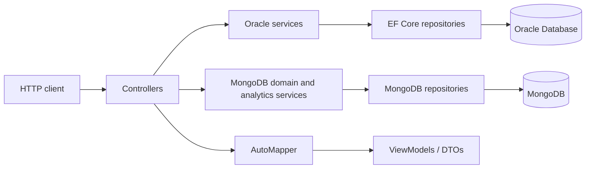
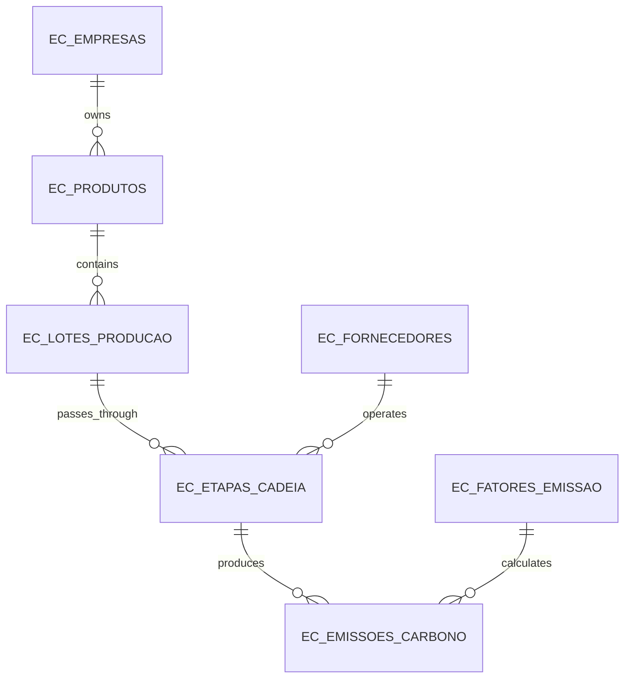

# Web.Fiap.Carbono

Web.Fiap.Carbono is a REST API for measuring and analyzing greenhouse-gas emissions across a product supply chain. It was built as an ESG-focused FIAP academic project and covers the environmental pillar of ESG.

The API connects companies, products, production batches, supply-chain stages, suppliers, emission factors, and carbon-emission records. It can calculate an emission in `kgCO2e` from activity data and an emission factor, then aggregate those records into product footprints, supplier rankings, and company dashboards.

This repository contains a backend API only; it does not include a web or mobile frontend.

## Main features

- Issue JWTs for two demonstration users with `ADMIN` and `ANALISTA_ESG` roles.
- List carbon-emission records with pagination and retrieve an individual record.
- Calculate and persist an emission for a supply-chain stage using an active emission factor.
- Calculate a product's total carbon footprint and break it down by supply-chain stage.
- Rank suppliers using the emissions associated with the stages they operate.
- Produce a company-level ESG summary with totals, counts, monthly emissions, average emissions per product, and the highest-emitting product and supplier.
- Validate request data, IDs, pagination, active emission factors, and database constraints.
- Expose MongoDB-backed CRUD endpoints for companies, products, suppliers, and emission factors, plus MongoDB-backed emission calculation and analytics during the migration transition.
- Return consistent JSON errors through global exception handling.
- Expose Swagger/OpenAPI documentation in the Development environment.
- Run API tests against isolated EF Core InMemory and disposable MongoDB databases.

The emission calculation is:

```text
emitted quantity (kgCO2e) = activity quantity × emission factor value
```

The API stores the result with the unit `kgCO2e`. It does not perform unit conversion, so the activity quantity must match the selected factor's base unit.

## Technology stack

| Area | Technology |
|---|---|
| Runtime and language | .NET 8, C# |
| Web framework | ASP.NET Core Web API |
| Database | Oracle Database and MongoDB 8 in a transitional hybrid configuration |
| Data access | Entity Framework Core 8 with `Oracle.EntityFrameworkCore` for the retained Oracle reads; `MongoDB.Driver` for migrated persistence and analytics |
| Schema management | EF Core migrations |
| Object mapping | AutoMapper |
| Authentication | JWT Bearer tokens signed with HMAC-SHA256 |
| API documentation | Swagger/OpenAPI through Swashbuckle |
| Tests | xUnit, `Microsoft.AspNetCore.Mvc.Testing`, Testcontainers for MongoDB, EF Core InMemory for retained Oracle paths, Coverlet |
| Packaging | Multi-stage Linux Docker image |

Important package versions are declared in [the API project file](Web.Fiap.Carbono/Web.Fiap.Carbono.csproj). The repository pins the .NET 8 SDK family in [`global.json`](global.json).

## Architecture

The code uses a layered controller-service-repository architecture. The classes under `ViewModel/` are API request and response DTOs; despite the name, this is not a conventional MVVM user-interface application.



| Directory | Responsibility |
|---|---|
| `Controllers/` | HTTP routes, status codes, and request/response handling |
| `Services/` | Domain validation, business rules, and emission calculation |
| `Data/Repository/` | EF Core queries and persistence |
| `Data/Contexts/` | Oracle table, relationship, index, and constraint mapping |
| `Data/MongoDb/` | MongoDB database and five-collection provider used by the migration |
| `Models/` | Database-backed domain entities |
| `Models/Documents/` | MongoDB document and embedded snapshot models |
| `Dtos/MongoDb/` | MongoDB CRUD, emission-calculation, and analytics contracts |
| `ViewModel/` | API input and output models |
| `Mapping/` | Domain-to-response transformations and aggregate calculations |
| `Config/Security/` | JWT settings |
| `Config/MongoDb/` | MongoDB connection and database-name settings |
| `Middlewares/` | Global exception-to-HTTP-response mapping |
| `Exceptions/` | Domain-specific exception types |
| `Migrations/` | Versioned Oracle schema |

Dependencies are registered with ASP.NET Core's built-in dependency injection container in [`Program.cs`](Web.Fiap.Carbono/Program.cs).

The application is currently in a transitional hybrid state. Company, product, supplier, and emission-factor CRUD, emission calculation, emission lookup by MongoDB ID, and the three analytics routes use MongoDB through dedicated services and repositories. The legacy paginated emission list and integer-ID emission lookup still use Oracle. A single reusable MongoDB client and the exact five-collection context are registered; Oracle and Entity Framework Core remain recoverable until the Phase 14 cutover gate is satisfied.

## Database

Oracle remains active for the legacy paginated emission list and integer-ID emission lookup, accessed through Entity Framework Core and Oracle's EF Core provider. MongoDB is configured under `MongoDb` and is active for master-data CRUD, MongoDB emission calculation and lookup, and product, supplier, and company analytics. This is an intentional migration transition rather than a completed Oracle replacement.

The schema is created by the `CreateCarbonEmissionSchema` EF Core migration. All application tables use the `EC_` prefix:

| Table | Purpose |
|---|---|
| `EC_EMPRESAS` | Companies whose products and emissions are tracked |
| `EC_PRODUTOS` | Products owned by a company |
| `EC_LOTES_PRODUCAO` | Production batches for a product |
| `EC_ETAPAS_CADEIA` | Ordered supply-chain stages for a batch, each linked to a supplier |
| `EC_FORNECEDORES` | Suppliers participating in supply-chain stages |
| `EC_FATORES_EMISSAO` | Emission factors, base units, references, and GHG scopes |
| `EC_EMISSOES_CARBONO` | Calculated activity and `kgCO2e` emission records |

### Entity relationships



The schema includes unique CNPJ indexes for companies and suppliers, foreign-key indexes, positive-value checks, date-order checks, active-status checks (`S` or `N`), and emission-scope checks (`ESCOPO_1`, `ESCOPO_2`, or `ESCOPO_3`). Foreign-key deletion is restrictive; related records are not cascade-deleted.

Authentication users are not stored in Oracle. The two demonstration users are currently held in memory by `AuthService`.

## API endpoints

All routes use the `/api` prefix. Except for emission creation, the current read endpoints are public.

| Method | Route | Authentication | Description |
|---|---|---|---|
| `POST` | `/api/auth/login` | Public | Validate a demonstration user and issue a JWT |
| `GET` | `/api/emissoes-carbono?pageNumber=1&pageSize=10` | Public | List emissions, newest first |
| `GET` | `/api/emissoes-carbono/{idEmissao}` | Public | Retrieve one emission and its stage/factor details |
| `GET` | `/api/emissoes-carbono/mongodb/{id}` | Public | Retrieve one MongoDB emission by `ObjectId` |
| `POST` | `/api/emissoes-carbono/calcular` | `ADMIN` or `ANALISTA_ESG` | Calculate and persist a MongoDB emission |
| `GET` | `/api/produtos-carbono/{idProduto}/pegada` | Public | Return a MongoDB product footprint and totals by stage |
| `GET` | `/api/fornecedores-carbono/ranking?pageNumber=1&pageSize=10` | Public | Return paginated MongoDB supplier emission summaries |
| `GET` | `/api/dashboard-carbono/empresas/{idEmpresa}/resumo` | Public | Return a company's MongoDB aggregated carbon dashboard |
| `POST`, `PUT` | `/api/empresas`, `/api/empresas/{id}` | `ADMIN` or `ANALISTA_ESG` | Create or replace a MongoDB company document |
| `GET` | `/api/empresas`, `/api/empresas/{id}` | Public | List or retrieve MongoDB company documents |
| `DELETE` | `/api/empresas/{id}` | `ADMIN` | Hard-delete `CRUD-TEMP` data or apply the documented governance policy |
| `POST`, `PUT` | `/api/produtos`, `/api/produtos/{id}` | `ADMIN` or `ANALISTA_ESG` | Create or replace a MongoDB product after validating its company |
| `GET` | `/api/produtos`, `/api/produtos/{id}` | Public | List or retrieve MongoDB product documents |
| `DELETE` | `/api/produtos/{id}` | `ADMIN` | Delete an unreferenced `CRUD-TEMP` product or deactivate a permanent one |
| `POST`, `PUT` | `/api/fornecedores`, `/api/fornecedores/{id}` | `ADMIN` or `ANALISTA_ESG` | Create or replace a MongoDB supplier |
| `GET` | `/api/fornecedores`, `/api/fornecedores/{id}` | Public | List or retrieve MongoDB supplier documents |
| `DELETE` | `/api/fornecedores/{id}` | `ADMIN` | Delete an unreferenced `CRUD-TEMP` supplier or deactivate a permanent one |
| `POST`, `PUT` | `/api/fatores-emissao`, `/api/fatores-emissao/{id}` | `ADMIN` | Create or replace a versioned MongoDB emission factor |
| `GET` | `/api/fatores-emissao`, `/api/fatores-emissao/{id}` | Public | List or retrieve MongoDB emission factors |
| `DELETE` | `/api/fatores-emissao/{id}` | `ADMIN` | Delete an unreferenced `CRUD-TEMP` factor or deactivate a permanent one |

Pagination starts at page 1. `pageSize` must be between 1 and 50. A paginated response has this shape:

```json
{
  "items": [],
  "pageNumber": 1,
  "pageSize": 10,
  "totalItems": 0,
  "totalPages": 0
}
```

MongoDB CRUD is exposed for the four master-data resources listed above. Production batches and supply-chain stages remain embedded in emission documents rather than becoming separate MongoDB collections. The calculation route creates immutable MongoDB emission events, while the dedicated `/mongodb/{id}` route reads them. The legacy paginated emission route and integer-ID lookup remain Oracle-backed until the final cutover.

## Authentication

Use one of the demonstration accounts:

| Role | Email | Password |
|---|---|---|
| `ADMIN` | `admin@carbono.com` | `Carbono@123` |
| `ANALISTA_ESG` | `analista@carbono.com` | `Carbono@123` |

Request a token:

```bash
curl --request POST http://localhost:5269/api/auth/login \
  --header "Content-Type: application/json" \
  --data '{
    "email": "admin@carbono.com",
    "senha": "Carbono@123"
  }'
```

Then send the returned token in the `Authorization` header:

```bash
curl --request POST http://localhost:5269/api/emissoes-carbono/calcular \
  --header "Authorization: Bearer YOUR_TOKEN" \
  --header "Content-Type: application/json" \
  --data '{
    "produtoId": "YOUR_PRODUCT_OBJECT_ID",
    "fornecedorId": "YOUR_SUPPLIER_OBJECT_ID",
    "fatorEmissaoId": "YOUR_FACTOR_OBJECT_ID",
    "lote": {
      "codigo": "LOTE-EXEMPLO",
      "quantidadeProduzida": 1000,
      "unidade": "unidades",
      "dataProducao": "2026-09-04T00:00:00Z"
    },
    "etapa": {
      "nome": "Consumo de energia",
      "ordem": 1,
      "categoria": "ENERGIA",
      "local": "São Paulo"
    },
    "quantidadeAtividade": 1500,
    "unidadeAtividade": "kWh",
    "dadosAtividade": {
      "tipo": "ENERGIA",
      "consumoKwh": 1500,
      "fonteEnergia": "REDE_NACIONAL",
      "percentualRenovavel": 25
    },
    "fonteEmissao": "Energia elétrica",
    "observacao": "Exemplo de cálculo MongoDB"
  }'
```

A successful calculation returns `201 Created`, including the created emission and a `Location` header for its MongoDB resource. Replace all three `YOUR_*_OBJECT_ID` values with coherent seeded document IDs, and ensure that `unidadeAtividade` and `quantidadeAtividade` match the selected factor and activity data.

> The built-in users and plain-text demonstration passwords are suitable only for this academic sample. A production deployment should use a persistent identity store, hashed passwords, secret management, HTTPS-only token handling, and an appropriate token-revocation strategy.

## Local setup

### Prerequisites

- .NET 8 SDK
- Access to an Oracle Database instance
- MongoDB 8, either locally or through the provided Compose service
- `dotnet-ef` 8.x if you need to apply or create migrations

### 1. Configure Oracle, JWT, and MongoDB

Create `Web.Fiap.Carbono/appsettings.Development.json`. This file is ignored by Git, so real credentials and signing keys are not committed.

```json
{
  "ConnectionStrings": {
    "OracleConnection": "User Id=YOUR_USER;Password=YOUR_PASSWORD;Data Source=YOUR_DATA_SOURCE"
  },
  "Jwt": {
    "SecretKey": "replace-with-a-random-secret-at-least-32-characters-long",
    "Issuer": "Web.Fiap.Carbono",
    "Audience": "Web.Fiap.Carbono.Users",
    "ExpirationMinutes": 60
  },
  "MongoDb": {
    "ConnectionString": "mongodb://localhost:27017",
    "DatabaseName": "fiap_carbono"
  }
}
```

ASP.NET Core configuration can also be supplied with environment variables such as `ConnectionStrings__OracleConnection`, `Jwt__SecretKey`, `MongoDb__ConnectionString`, and `MongoDb__DatabaseName`. Safe MongoDB examples are provided in [`.env.example`](.env.example); do not commit credentials.

### 2. Start MongoDB

```bash
docker compose up -d mongodb
docker compose ps
```

### 3. Initialize the MongoDB demonstration database

Run the scripts in order. The seed creates at least ten coherent persistent documents in each of the five collections; the CRUD demonstration creates and removes only explicitly named `CRUD-TEMP` records; and the aggregation script is read-only.

```bash
mongosh "mongodb://localhost:27017/fiap_carbono" \
  --file database/mongodb/01-create-collections.js

mongosh "mongodb://localhost:27017/fiap_carbono" \
  --file database/mongodb/02-create-indexes.js

mongosh "mongodb://localhost:27017/fiap_carbono" \
  --file database/mongodb/03-seed.js

mongosh "mongodb://localhost:27017/fiap_carbono" \
  --file database/mongodb/04-crud-demo.js

mongosh "mongodb://localhost:27017/fiap_carbono" \
  --file database/mongodb/05-aggregation-queries.js
```

### 4. Restore and build

From the repository root:

```bash
dotnet restore Web.Fiap.Carbono.sln
dotnet build Web.Fiap.Carbono.sln
```

### 5. Apply the Oracle schema

```bash
dotnet ef database update \
  --project Web.Fiap.Carbono/Web.Fiap.Carbono.csproj \
  --startup-project Web.Fiap.Carbono/Web.Fiap.Carbono.csproj
```

The migration creates the schema only; it does not seed production data.

### 6. Run the API

```bash
dotnet run --project Web.Fiap.Carbono/Web.Fiap.Carbono.csproj
```

With the checked-in launch profile, the HTTP URL is `http://localhost:5269` and the HTTPS URL is `https://localhost:7090`. Swagger is available only when `ASPNETCORE_ENVIRONMENT=Development`:

```text
http://localhost:5269/swagger
```

Ready-to-run request examples are available in [`Web.Fiap.Carbono.http`](Web.Fiap.Carbono/Web.Fiap.Carbono.http).

## Tests

Run all tests from the repository root:

```bash
dotnet test Web.Fiap.Carbono.sln
```

The retained Oracle-path API tests start the real ASP.NET Core application through `WebApplicationFactory`, replace Oracle with a uniquely named EF Core InMemory database, and cover the legacy emission list and integer-ID lookup without requiring a developer Oracle database.

MongoDB repository, service, and API integration tests use disposable MongoDB 8.0.29 containers instead of a developer's permanent database. They cover master-data CRUD, unique constraints, pagination, cross-document references, JWT roles, destructive-operation policy, all four flexible activity variants, decimal emission calculation, applied-factor snapshots, analytics pipelines, global errors, and Swagger metadata. The complete suite passed 87/87 tests on 2026-09-04.

## Docker

Build the multi-stage image from the repository root:

```bash
docker build \
  --file Web.Fiap.Carbono/Dockerfile \
  --tag web-fiap-carbono .
```

Supply configuration at runtime rather than baking secrets into the image:

```bash
docker run --rm --publish 8080:8080 \
  --env ConnectionStrings__OracleConnection="YOUR_ORACLE_CONNECTION_STRING" \
  --env Jwt__SecretKey="YOUR_RANDOM_JWT_SECRET" \
  --env Jwt__Issuer="Web.Fiap.Carbono" \
  --env Jwt__Audience="Web.Fiap.Carbono.Users" \
  --env Jwt__ExpirationMinutes="60" \
  --env MongoDb__ConnectionString="YOUR_MONGODB_CONNECTION_STRING" \
  --env MongoDb__DatabaseName="fiap_carbono" \
  web-fiap-carbono
```

Swagger is disabled by default in the container because the image does not set the Development environment.

## Error responses

Unhandled domain exceptions are converted to JSON by the global middleware:

```json
{
  "statusCode": 404,
  "error": "NotFound",
  "message": "Etapa da cadeia não encontrada.",
  "timestamp": "2026-08-26T12:00:00Z"
}
```

The main mappings are `400` for validation/argument errors, `401` for invalid login or missing authentication, `404` for missing domain records, `422` for business-rule violations such as an inactive emission factor, and `500` for unexpected failures.
