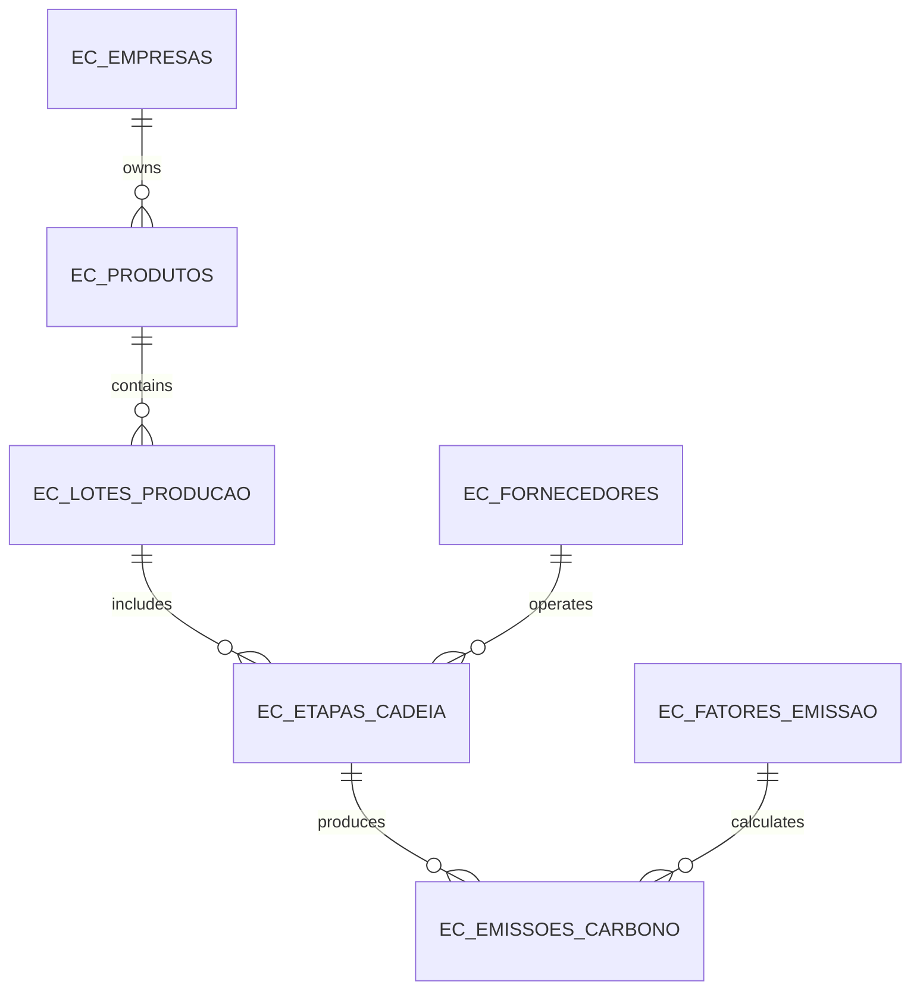
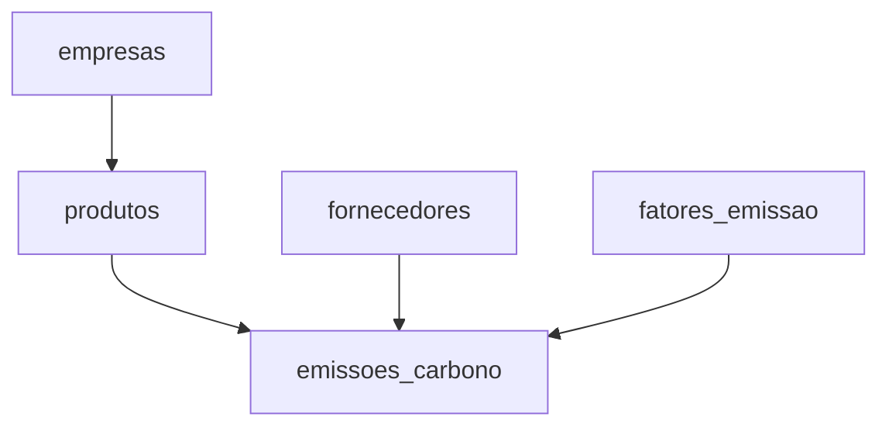

# Web.Fiap.Carbono — MongoDB Migration

## Document status

This document defines and records the migration of **Web.Fiap.Carbono** from Oracle Database and Entity Framework Core to MongoDB. It is also the technical report for the FIAP MongoDB challenge.

The target architecture and commands are defined here before implementation. Sections marked as **execution evidence** must be completed only after the corresponding scripts and API operations have been run. Do not present planned results as completed work.

Oracle remains the active persistence provider. The [Oracle API baseline](oracle-baseline.md) records observable responses and representative totals for comparison with the future MongoDB implementation. Its calculation request succeeded with `201 Created`, persisted emission `41`, and returned `122.55 kgCO2e`; detailed evidence and the remaining aggregate-refresh status are maintained in the baseline report.

### Local MongoDB environment status

Phase 2 was verified on 2026-08-31 using the course-supported `mongo:8.0.29-noble` image defined in `compose.yaml`. The local service binds port `27017` only to `127.0.0.1`, stores data in the named `fiap_carbono_mongodb_data` volume, and uses a `mongosh` ping health check.

Docker reported the container as healthy. A direct `mongosh` connection to `mongodb://localhost:27017/fiap_carbono` returned `{ ok: 1 }` with `fiap_carbono` as the database context, and MongoDB Compass connected successfully through port `27017`. The safe example settings are stored in `.env.example`, while the local `.env` is ignored and untracked.

This environment is isolated from the running application at this phase. Oracle remains the active API persistence provider; no MongoDB driver or application persistence configuration has been added yet.

## 1. Project overview

Web.Fiap.Carbono is an ASP.NET Core Web API for measuring and analyzing greenhouse-gas emissions across product supply chains. It connects companies, products, production batches, supply-chain stages, suppliers, emission factors, and calculated carbon-emission records.

The main calculation is:

```text
emitted quantity (kgCO2e) = activity quantity × emission factor value
```

The application also provides:

- a product carbon-footprint breakdown;
- a supplier emissions ranking;
- a company-level carbon dashboard;
- JWT authorization for `ADMIN` and `ANALISTA_ESG` users;
- validation and consistent API error responses.

The project primarily addresses the **environmental** pillar of ESG by quantifying carbon emissions. The MongoDB model also represents:

- **Social:** supplier labor indicators and social certifications;
- **Governance:** factor versioning, calculation provenance, audit metadata, responsible users, and historical snapshots.

## 2. Decision: migration

The selected challenge option is **Migration**.

The existing ESG application already has a defined domain, business rules, and analytical use cases. Migrating it provides a stronger demonstration than inventing an unrelated application because the relational and document-oriented designs can be compared directly.

The goal is not to translate every Oracle table into a MongoDB collection. A table-for-collection conversion would preserve relational boundaries without using the main strengths of a document database. Instead, the new model is organized around independently managed business entities and the data read together for each emission event.

The migration must preserve:

- the emission formula and `kgCO2e` result;
- validation of active and valid emission factors;
- traceability of company, product, supplier, and factor;
- product-footprint, supplier-ranking, and dashboard behavior;
- authentication and authorization behavior where applicable;
- stable API contracts where retaining them is practical.

## 3. Original relational model

The current Oracle schema contains seven tables:

| Table | Responsibility |
| --- | --- |
| `EC_EMPRESAS` | Companies whose products and emissions are tracked |
| `EC_PRODUTOS` | Products owned by a company |
| `EC_LOTES_PRODUCAO` | Production batches associated with products |
| `EC_ETAPAS_CADEIA` | Ordered supply-chain stages, each associated with a batch and supplier |
| `EC_FORNECEDORES` | Suppliers participating in supply-chain stages |
| `EC_FATORES_EMISSAO` | Emission factors, units, sources, and GHG scopes |
| `EC_EMISSOES_CARBONO` | Activity quantities and calculated carbon emissions |



This structure provides referential integrity, but reading a complete emission context requires joins across emissions, factors, stages, batches, products, companies, and suppliers. Activity-specific data is also difficult to evolve when every activity must fit the same fixed set of columns.

## 4. Why MongoDB fits the ESG problem

### 4.1 Flexible activity data

Transport, energy, raw-material, and waste activities do not share every measurement field. MongoDB allows the stable emission fields to remain consistent while a nested `dadosAtividade` document varies by activity type.

This flexibility is controlled rather than arbitrary: every variant represents a real ESG measurement context.

### 4.2 Auditable historical records

An emission record must remain reproducible even if a factor, product, or supplier changes later. The MongoDB design stores an immutable `fatorAplicado` snapshot and event-context snapshots inside each emission document.

### 4.3 Aggregation-oriented analytics

MongoDB aggregation pipelines can group emissions by product, supplier, scope, month, or supply-chain category. A `$facet` pipeline can calculate several dashboard summaries from one filtered company dataset.

### 4.4 Scalable event history

Carbon-emission records can grow much faster than reference data. Keeping each emission as its own document supports an append-oriented history and avoids an unbounded array inside a company or product document.

As the emission history grows, MongoDB could support horizontal scaling through sharding. The shard-key strategy would need to be selected from observed access and write patterns. This is a future architectural possibility; the local academic environment does not deploy a sharded cluster.

### 4.5 Availability and deployment options

MongoDB replica sets and managed deployments can provide redundancy and failover. These capabilities are relevant to an ESG platform that may receive data from multiple facilities, but production high availability is outside this academic implementation's required scope.

### 4.6 Trade-offs

MongoDB does not automatically enforce foreign keys between collections. The application must therefore validate referenced documents and use indexes, tests, reconciliation checks, and controlled deletion rules to preserve consistency.

Denormalized snapshots also duplicate some data. This is intentional: the duplicated values preserve the exact calculation context and reduce joins during reads.

MongoDB can support emission measurement, traceability, analytical queries, and system availability, but the database technology does not inherently make the application or the organization sustainable. Sustainability depends on the quality of the collected data, organizational decisions, operational changes, and measurable ESG outcomes.

## 5. Seven-table-to-five-collection mapping

The target database is `fiap_carbono` and contains exactly five ESG domain collections.

| Oracle source | MongoDB target | Modeling decision |
| --- | --- | --- |
| `EC_EMPRESAS` | `empresas` | One independently maintained company document |
| `EC_PRODUTOS` | `produtos` | One product document referencing its company |
| `EC_FORNECEDORES` | `fornecedores` | One supplier document with flexible ESG attributes |
| `EC_FATORES_EMISSAO` | `fatores_emissao` | Versioned factor documents |
| `EC_EMISSOES_CARBONO` | `emissoes_carbono` | One auditable emission event per document |
| `EC_LOTES_PRODUCAO` | Embedded in `emissoes_carbono.lote` | Snapshot of the batch used by the event |
| `EC_ETAPAS_CADEIA` | Embedded in `emissoes_carbono.etapa` | Snapshot of the supply-chain context |



Authentication users remain in the existing in-memory `AuthService` for this assignment. Creating a user collection would exceed the requirement of exactly five ESG collections without improving the requested data-model demonstration.

## 6. Detailed collection descriptions

### 6.1 `empresas`

Represents organizations that own products and report emissions.

ESG contribution:

- environmental reduction targets;
- reporting year and sustainability settings;
- governance contacts and audit configuration.

Example:

```javascript
{
  _id: ObjectId("..."),
  codigo: "EMP-001",
  razaoSocial: "Verde Circular Industria S.A.",
  nomeFantasia: "Verde Circular",
  cnpj: "12345678000190",
  setor: "MANUFATURA",
  ativa: true,
  metasReducao: [
    {
      anoBase: 2024,
      anoAlvo: 2030,
      percentualReducao: Decimal128("30.00"),
      escopos: ["ESCOPO_1", "ESCOPO_2"]
    }
  ],
  governanca: {
    responsavelEsg: "Marina Costa",
    emailResponsavel: "marina.costa@example.com",
    periodicidadeAuditoria: "ANUAL"
  },
  criadoEm: ISODate("2026-08-01T12:00:00Z"),
  atualizadoEm: ISODate("2026-08-01T12:00:00Z"),
  schemaVersion: 1
}
```

### 6.2 `produtos`

Represents products owned by a company. It references `empresas` because a company is independently maintained and may own many products.

ESG contribution:

- material composition;
- recyclability and packaging attributes;
- functional unit and product-footprint metadata;
- sustainability labels.

Example:

```javascript
{
  _id: ObjectId("..."),
  empresaId: ObjectId("..."),
  codigo: "PROD-001",
  nome: "Garrafa Circular 750 ml",
  categoria: "EMBALAGEM",
  unidadeFuncional: "UNIDADE",
  atributosAmbientais: {
    materiais: [
      { nome: "ALUMINIO", percentual: Decimal128("85.00") },
      { nome: "PLASTICO_RECICLADO", percentual: Decimal128("15.00") }
    ],
    percentualReciclavel: Decimal128("95.00"),
    embalagemRetornavel: true,
    selos: ["RECICLAVEL"]
  },
  ativo: true,
  criadoEm: ISODate("2026-08-01T12:00:00Z"),
  atualizadoEm: ISODate("2026-08-01T12:00:00Z"),
  schemaVersion: 1
}
```

### 6.3 `fornecedores`

Represents suppliers participating in the product supply chain.

ESG contribution:

- environmental compliance and certifications;
- labor and diversity indicators;
- governance audit status and risk classification.

Example:

```javascript
{
  _id: ObjectId("..."),
  codigo: "FOR-001",
  razaoSocial: "Transporte Limpo Ltda.",
  nomeFantasia: "Transporte Limpo",
  cnpj: "22345678000180",
  categoriasAtuacao: ["TRANSPORTE", "LOGISTICA"],
  certificacoes: [
    {
      nome: "ISO 14001",
      emissor: "Organismo Certificador",
      validaAte: ISODate("2028-12-31T23:59:59Z")
    }
  ],
  indicadoresSociais: {
    possuiPoliticaDireitosHumanos: true,
    taxaAcidentesPorCemColaboradores: Decimal128("0.80")
  },
  conformidadeAmbiental: {
    status: "CONFORME",
    ultimaVerificacao: ISODate("2026-07-15T12:00:00Z")
  },
  statusAuditoria: "APROVADO",
  nivelRiscoEsg: "BAIXO",
  ativo: true,
  criadoEm: ISODate("2026-08-01T12:00:00Z"),
  atualizadoEm: ISODate("2026-08-01T12:00:00Z"),
  schemaVersion: 1
}
```

### 6.4 `fatores_emissao`

Represents versioned emission factors used in calculations.

ESG contribution:

- documented technical source and methodology;
- GHG Protocol scope classification;
- validity period and activation state;
- version history for governance and auditability.

Example:

```javascript
{
  _id: ObjectId("..."),
  codigo: "FE-TRANS-DIESEL",
  nome: "Transporte rodoviario a diesel",
  categoria: "TRANSPORTE",
  valor: Decimal128("0.184"),
  unidadeBase: "TON_KM",
  escopo: "ESCOPO_3",
  fonteReferencia: "Base tecnica de referencia",
  metodologia: "Atividade multiplicada pelo fator",
  versao: 2,
  validoDe: ISODate("2026-01-01T00:00:00Z"),
  validoAte: ISODate("2026-12-31T23:59:59Z"),
  ativo: true,
  criadoEm: ISODate("2026-01-01T00:00:00Z"),
  atualizadoEm: ISODate("2026-01-01T00:00:00Z"),
  schemaVersion: 1
}
```

### 6.5 `emissoes_carbono`

Represents an emission event and the complete historical context required to understand its calculation.

ESG contribution:

- environmental impact in `kgCO2e`;
- accountable user and calculation timestamp;
- applied-factor snapshot and data provenance;
- supply-chain, batch, supplier, and product traceability.

Example:

```javascript
{
  _id: ObjectId("..."),
  empresaId: ObjectId("..."),
  produtoId: ObjectId("..."),
  fornecedorId: ObjectId("..."),
  fatorEmissaoId: ObjectId("..."),
  lote: {
    codigo: "LOTE-2026-001",
    quantidadeProduzida: Decimal128("1500.00"),
    unidade: "UNIDADES",
    dataProducao: ISODate("2026-08-01T00:00:00Z")
  },
  etapa: {
    nome: "Transporte rodoviario",
    ordem: 3,
    local: "Sao Paulo",
    categoria: "TRANSPORTE"
  },
  quantidadeAtividade: Decimal128("420.00"),
  dadosAtividade: {
    tipo: "TRANSPORTE",
    distanciaKm: Decimal128("350.00"),
    cargaToneladas: Decimal128("1.20"),
    combustivel: "DIESEL"
  },
  fatorAplicado: {
    codigo: "FE-TRANS-DIESEL",
    nome: "Transporte rodoviario a diesel",
    valor: Decimal128("0.184"),
    unidadeBase: "TON_KM",
    escopo: "ESCOPO_3",
    versao: 2,
    fonteReferencia: "Base tecnica de referencia"
  },
  quantidadeEmitidaKgCO2e: Decimal128("77.280"),
  fonteEmissao: "Diesel",
  observacao: "Entrega ao centro de distribuicao",
  metodoCalculo: "QuantidadeAtividade * ValorFatorCo2e",
  calculadoPor: "analista@carbono.com",
  dataEmissao: ISODate("2026-08-10T14:30:00Z"),
  criadoEm: ISODate("2026-08-10T14:31:00Z"),
  atualizadoEm: ISODate("2026-08-10T14:31:00Z"),
  schemaVersion: 1
}
```

## 7. Embedding and referencing decisions

| Data | Strategy | Reason |
| --- | --- | --- |
| Company from product | Reference with `empresaId` | Companies are maintained independently and may own many products |
| Company, product, supplier, and factor from emission | Reference with `ObjectId` | Supports direct filtering and connection to current reference data |
| Batch in emission | Embed as `lote` | The batch context is read with the emission and does not need an independent CRUD lifecycle in the target scope |
| Supply-chain stage in emission | Embed as `etapa` | Preserves the exact event context and avoids repeated joins |
| Applied factor in emission | Embed as `fatorAplicado` snapshot | A later factor update must not change historical calculation evidence |
| Emissions in company or product | Separate documents | The event history grows without a fixed bound and must remain queryable and pageable |

Additional rules:

- MongoDB `_id` values use `ObjectId`.
- API DTOs may expose IDs as strings, but invalid values must return a validation error rather than a server error.
- Dates are stored as UTC BSON dates.
- CNPJ values are stored as strings to preserve leading zeroes.
- Calculation fields use BSON `Decimal128`, not binary floating point.
- Enums are stored as descriptive strings.
- Documents expected to evolve include `schemaVersion`.
- Migrated records include `legacyId` for Oracle reconciliation.
- Application services validate references before writes because MongoDB has no foreign-key constraints.

### Historical snapshot rule

`fatorEmissaoId` points to the current factor document, while `fatorAplicado` stores what was actually used. Analytics and audits of historical emissions must read the snapshot, not recalculate old values from the current factor.

## 8. Flexible-schema examples

The stable emission envelope remains the same, but `dadosAtividade` varies by `tipo`.

### Transport

```javascript
dadosAtividade: {
  tipo: "TRANSPORTE",
  distanciaKm: Decimal128("350.00"),
  cargaToneladas: Decimal128("1.20"),
  combustivel: "DIESEL"
}
```

### Energy

```javascript
dadosAtividade: {
  tipo: "ENERGIA",
  consumoKwh: Decimal128("950.00"),
  fonteEnergia: "SOLAR",
  percentualRenovavel: Decimal128("100.00")
}
```

### Raw material

```javascript
dadosAtividade: {
  tipo: "MATERIA_PRIMA",
  material: "ALUMINIO",
  pesoKg: Decimal128("800.00"),
  percentualReciclado: Decimal128("65.00")
}
```

### Waste

```javascript
dadosAtividade: {
  tipo: "RESIDUO",
  classe: "NAO_PERIGOSO",
  pesoKg: Decimal128("230.00"),
  tratamento: "RECICLAGEM",
  distanciaDestinoKm: Decimal128("18.00")
}
```

These variations demonstrate a meaningful flexible schema. They must not be implemented as unrelated optional fields at the emission root.

## 9. Validators and indexes

Validators protect stable invariants without forcing every document variant into an identical shape. The committed implementation must live in `database/mongodb/01-create-collections.js`; the following excerpts document the intended constraints.

### 9.1 Validator principles

- require identity, reference, calculation, timestamp, and version fields;
- validate core BSON types;
- validate known fixed enumerations where they are stable;
- allow flexible nested ESG fields;
- avoid `additionalProperties: false`, which can block controlled schema evolution;
- enforce cross-document business rules in application services and tests.

### 9.2 Collection creation with validators

```javascript
db.createCollection("empresas", {
  validator: {
    $jsonSchema: {
      bsonType: "object",
      required: ["_id", "codigo", "razaoSocial", "cnpj", "ativa", "criadoEm", "atualizadoEm", "schemaVersion"],
      properties: {
        _id: { bsonType: "objectId" },
        codigo: { bsonType: "string" },
        razaoSocial: { bsonType: "string" },
        cnpj: { bsonType: "string" },
        ativa: { bsonType: "bool" },
        metasReducao: { bsonType: "array" },
        governanca: { bsonType: "object" },
        criadoEm: { bsonType: "date" },
        atualizadoEm: { bsonType: "date" },
        schemaVersion: { bsonType: "int", minimum: 1 }
      }
    }
  },
  validationLevel: "strict",
  validationAction: "error"
})

db.createCollection("produtos", {
  validator: {
    $jsonSchema: {
      bsonType: "object",
      required: ["_id", "empresaId", "codigo", "nome", "unidadeFuncional", "ativo", "criadoEm", "atualizadoEm", "schemaVersion"],
      properties: {
        _id: { bsonType: "objectId" },
        empresaId: { bsonType: "objectId" },
        codigo: { bsonType: "string" },
        nome: { bsonType: "string" },
        unidadeFuncional: { bsonType: "string" },
        atributosAmbientais: { bsonType: "object" },
        ativo: { bsonType: "bool" },
        criadoEm: { bsonType: "date" },
        atualizadoEm: { bsonType: "date" },
        schemaVersion: { bsonType: "int", minimum: 1 }
      }
    }
  },
  validationLevel: "strict",
  validationAction: "error"
})

db.createCollection("fornecedores", {
  validator: {
    $jsonSchema: {
      bsonType: "object",
      required: ["_id", "codigo", "razaoSocial", "cnpj", "ativo", "criadoEm", "atualizadoEm", "schemaVersion"],
      properties: {
        _id: { bsonType: "objectId" },
        codigo: { bsonType: "string" },
        razaoSocial: { bsonType: "string" },
        cnpj: { bsonType: "string" },
        categoriasAtuacao: { bsonType: "array" },
        certificacoes: { bsonType: "array" },
        indicadoresSociais: { bsonType: "object" },
        conformidadeAmbiental: { bsonType: "object" },
        ativo: { bsonType: "bool" },
        criadoEm: { bsonType: "date" },
        atualizadoEm: { bsonType: "date" },
        schemaVersion: { bsonType: "int", minimum: 1 }
      }
    }
  },
  validationLevel: "strict",
  validationAction: "error"
})

db.createCollection("fatores_emissao", {
  validator: {
    $jsonSchema: {
      bsonType: "object",
      required: ["_id", "codigo", "nome", "valor", "unidadeBase", "escopo", "versao", "ativo", "criadoEm", "atualizadoEm", "schemaVersion"],
      properties: {
        _id: { bsonType: "objectId" },
        codigo: { bsonType: "string" },
        nome: { bsonType: "string" },
        valor: { bsonType: "decimal" },
        unidadeBase: { bsonType: "string" },
        escopo: { enum: ["ESCOPO_1", "ESCOPO_2", "ESCOPO_3"] },
        versao: { bsonType: "int", minimum: 1 },
        validoDe: { bsonType: "date" },
        validoAte: { bsonType: ["date", "null"] },
        ativo: { bsonType: "bool" },
        criadoEm: { bsonType: "date" },
        atualizadoEm: { bsonType: "date" },
        schemaVersion: { bsonType: "int", minimum: 1 }
      }
    }
  },
  validationLevel: "strict",
  validationAction: "error"
})

db.createCollection("emissoes_carbono", {
  validator: {
    $jsonSchema: {
      bsonType: "object",
      required: [
        "_id",
        "empresaId",
        "produtoId",
        "fornecedorId",
        "fatorEmissaoId",
        "lote",
        "etapa",
        "quantidadeAtividade",
        "dadosAtividade",
        "fatorAplicado",
        "quantidadeEmitidaKgCO2e",
        "metodoCalculo",
        "calculadoPor",
        "dataEmissao",
        "criadoEm",
        "atualizadoEm",
        "schemaVersion"
      ],
      properties: {
        _id: { bsonType: "objectId" },
        empresaId: { bsonType: "objectId" },
        produtoId: { bsonType: "objectId" },
        fornecedorId: { bsonType: "objectId" },
        fatorEmissaoId: { bsonType: "objectId" },
        lote: { bsonType: "object" },
        etapa: { bsonType: "object" },
        quantidadeAtividade: { bsonType: "decimal" },
        dadosAtividade: { bsonType: "object" },
        fatorAplicado: { bsonType: "object" },
        quantidadeEmitidaKgCO2e: { bsonType: "decimal" },
        metodoCalculo: { bsonType: "string" },
        calculadoPor: { bsonType: "string" },
        dataEmissao: { bsonType: "date" },
        criadoEm: { bsonType: "date" },
        atualizadoEm: { bsonType: "date" },
        schemaVersion: { bsonType: "int", minimum: 1 }
      }
    }
  },
  validationLevel: "strict",
  validationAction: "error"
})
```

### 9.3 Indexes

The committed implementation must live in `database/mongodb/02-create-indexes.js`.

```javascript
db.empresas.createIndex({ codigo: 1 }, { unique: true, name: "ux_empresas_codigo" })
db.empresas.createIndex({ cnpj: 1 }, { unique: true, name: "ux_empresas_cnpj" })

db.produtos.createIndex(
  { empresaId: 1, codigo: 1 },
  { unique: true, name: "ux_produtos_empresa_codigo" }
)
db.produtos.createIndex({ empresaId: 1, ativo: 1 }, { name: "ix_produtos_empresa_ativo" })

db.fornecedores.createIndex({ codigo: 1 }, { unique: true, name: "ux_fornecedores_codigo" })
db.fornecedores.createIndex({ cnpj: 1 }, { unique: true, name: "ux_fornecedores_cnpj" })

db.fatores_emissao.createIndex(
  { codigo: 1, versao: 1 },
  { unique: true, name: "ux_fatores_codigo_versao" }
)
db.fatores_emissao.createIndex(
  { categoria: 1, escopo: 1, ativo: 1 },
  { name: "ix_fatores_categoria_escopo_ativo" }
)

db.emissoes_carbono.createIndex(
  { produtoId: 1, dataEmissao: -1 },
  { name: "ix_emissoes_produto_data" }
)
db.emissoes_carbono.createIndex(
  { empresaId: 1, dataEmissao: -1 },
  { name: "ix_emissoes_empresa_data" }
)
db.emissoes_carbono.createIndex(
  { fornecedorId: 1, dataEmissao: -1 },
  { name: "ix_emissoes_fornecedor_data" }
)
db.emissoes_carbono.createIndex({ fatorEmissaoId: 1 }, { name: "ix_emissoes_fator" })
db.emissoes_carbono.createIndex({ "etapa.categoria": 1 }, { name: "ix_emissoes_etapa_categoria" })
```

Indexes support known access patterns; they should be reviewed with `explain("executionStats")` once the final query shapes and dataset are available.

## 10. Creation commands

The database scripts are organized as follows:

```text
database/mongodb/
├── 01-create-collections.js
├── 02-create-indexes.js
├── 03-seed.js
├── 04-crud-demo.js
└── 05-aggregation-queries.js
```

Run the collection and index scripts from the repository root:

```bash
mongosh "mongodb://localhost:27017/fiap_carbono" \
  --file database/mongodb/01-create-collections.js

mongosh "mongodb://localhost:27017/fiap_carbono" \
  --file database/mongodb/02-create-indexes.js
```

Verify the result:

```javascript
db.getName()
db.getCollectionNames().sort()

db.empresas.getIndexes()
db.produtos.getIndexes()
db.fornecedores.getIndexes()
db.fatores_emissao.getIndexes()
db.emissoes_carbono.getIndexes()
```

Expected collection names:

```text
empresas
emissoes_carbono
fatores_emissao
fornecedores
produtos
```

Phase 3 was verified on 2026-08-31 against MongoDB 8.0.29. Both scripts completed successfully twice, proving the update-in-place validator flow and named index creation are safe to rerun. The database contained exactly the five expected collections, all with `strict`/`error` validation. Valid temporary documents were accepted and representative invalid documents were rejected in every collection; the temporary records were then removed. The required unique and query indexes were inspected successfully.

**Execution evidence:** add the actual terminal or Compass screenshot to `docs/images/mongodb/01-collections-created.png` and the index screenshot to `docs/images/mongodb/02-indexes.png`.

## 11. Seed data

The seed must contain at least ten persistent documents in every collection:

| Collection | Minimum permanent documents |
| --- | ---: |
| `empresas` | 10 |
| `produtos` | 10 |
| `fornecedores` | 10 |
| `fatores_emissao` | 10 |
| `emissoes_carbono` | 10 |

The records must form a coherent graph. Every product must reference an existing company, and every emission must reference existing company, product, supplier, and factor documents.

The seed should include several GHG scopes and activity types. At minimum, emission documents must demonstrate `TRANSPORTE`, `ENERGIA`, and `MATERIA_PRIMA` variants of `dadosAtividade`.

Run the committed seed script:

```bash
mongosh "mongodb://localhost:27017/fiap_carbono" \
  --file database/mongodb/03-seed.js
```

Use deterministic business keys such as `EMP-001`, `PROD-001`, `FOR-001`, and `FE-ENERGIA-001`. The script should resolve generated `ObjectId` references from these keys instead of hard-coding unrelated IDs.

Recommended pattern:

```javascript
const empresa = db.empresas.findOne({ codigo: "EMP-001" })
const produto = db.produtos.findOne({ empresaId: empresa._id, codigo: "PROD-001" })
const fornecedor = db.fornecedores.findOne({ codigo: "FOR-001" })
const fator = db.fatores_emissao.findOne({ codigo: "FE-TRANS-DIESEL", versao: 1 })

db.emissoes_carbono.insertOne({
  empresaId: empresa._id,
  produtoId: produto._id,
  fornecedorId: fornecedor._id,
  fatorEmissaoId: fator._id,
  // Remaining event fields and snapshots omitted here.
})
```

Verify final counts:

```javascript
[
  "empresas",
  "produtos",
  "fornecedores",
  "fatores_emissao",
  "emissoes_carbono"
].map(nome => ({
  collection: nome,
  count: db.getCollection(nome).countDocuments()
}))
```

**Acceptance condition:** every count is at least `10` after the CRUD demonstration has removed its temporary documents.

## 12. CRUD commands

The complete executable demonstration must live in `database/mongodb/04-crud-demo.js`. Each collection follows the same verifiable lifecycle:

1. insert a temporary eleventh record;
2. read it;
3. update it;
4. read it again to prove the update;
5. delete it;
6. prove that the temporary record no longer exists;
7. confirm that at least ten permanent documents remain.

### 12.1 `empresas`

```javascript
db.empresas.insertOne({
  codigo: "CRUD-TEMP-EMP",
  razaoSocial: "Empresa CRUD Temporaria Ltda.",
  nomeFantasia: "Empresa Temporaria",
  cnpj: "99999999000101",
  setor: "SERVICOS",
  ativa: true,
  metasReducao: [],
  governanca: { periodicidadeAuditoria: "ANUAL" },
  criadoEm: new Date(),
  atualizadoEm: new Date(),
  schemaVersion: 1
})

db.empresas.findOne({ codigo: "CRUD-TEMP-EMP" })

db.empresas.updateOne(
  { codigo: "CRUD-TEMP-EMP" },
  { $set: { nomeFantasia: "Empresa CRUD Atualizada", atualizadoEm: new Date() } }
)

db.empresas.findOne({ codigo: "CRUD-TEMP-EMP" })
db.empresas.deleteOne({ codigo: "CRUD-TEMP-EMP" })
db.empresas.findOne({ codigo: "CRUD-TEMP-EMP" })
db.empresas.countDocuments()
```

### 12.2 `produtos`

```javascript
const empresaPermanente = db.empresas.findOne({ codigo: "EMP-001" })

db.produtos.insertOne({
  empresaId: empresaPermanente._id,
  codigo: "CRUD-TEMP-PROD",
  nome: "Produto CRUD Temporario",
  categoria: "TESTE",
  unidadeFuncional: "UNIDADE",
  atributosAmbientais: { percentualReciclavel: Decimal128("10.00") },
  ativo: true,
  criadoEm: new Date(),
  atualizadoEm: new Date(),
  schemaVersion: 1
})

db.produtos.findOne({ codigo: "CRUD-TEMP-PROD" })

db.produtos.updateOne(
  { codigo: "CRUD-TEMP-PROD" },
  {
    $set: {
      "atributosAmbientais.percentualReciclavel": Decimal128("25.00"),
      atualizadoEm: new Date()
    }
  }
)

db.produtos.findOne({ codigo: "CRUD-TEMP-PROD" })
db.produtos.deleteOne({ codigo: "CRUD-TEMP-PROD" })
db.produtos.findOne({ codigo: "CRUD-TEMP-PROD" })
db.produtos.countDocuments()
```

### 12.3 `fornecedores`

```javascript
db.fornecedores.insertOne({
  codigo: "CRUD-TEMP-FOR",
  razaoSocial: "Fornecedor CRUD Temporario Ltda.",
  nomeFantasia: "Fornecedor Temporario",
  cnpj: "99999999000102",
  categoriasAtuacao: ["LOGISTICA"],
  certificacoes: [],
  indicadoresSociais: { possuiPoliticaDireitosHumanos: false },
  conformidadeAmbiental: { status: "EM_ANALISE" },
  statusAuditoria: "PENDENTE",
  ativo: true,
  criadoEm: new Date(),
  atualizadoEm: new Date(),
  schemaVersion: 1
})

db.fornecedores.findOne({ codigo: "CRUD-TEMP-FOR" })

db.fornecedores.updateOne(
  { codigo: "CRUD-TEMP-FOR" },
  {
    $set: {
      "conformidadeAmbiental.status": "CONFORME",
      statusAuditoria: "APROVADO",
      atualizadoEm: new Date()
    }
  }
)

db.fornecedores.findOne({ codigo: "CRUD-TEMP-FOR" })
db.fornecedores.deleteOne({ codigo: "CRUD-TEMP-FOR" })
db.fornecedores.findOne({ codigo: "CRUD-TEMP-FOR" })
db.fornecedores.countDocuments()
```

### 12.4 `fatores_emissao`

```javascript
db.fatores_emissao.insertOne({
  codigo: "CRUD-TEMP-FE",
  nome: "Fator CRUD Temporario",
  categoria: "TESTE",
  valor: Decimal128("0.500"),
  unidadeBase: "KG",
  escopo: "ESCOPO_3",
  fonteReferencia: "Demonstracao academica",
  metodologia: "Atividade multiplicada pelo fator",
  versao: 1,
  validoDe: ISODate("2026-01-01T00:00:00Z"),
  validoAte: ISODate("2026-12-31T23:59:59Z"),
  ativo: true,
  criadoEm: new Date(),
  atualizadoEm: new Date(),
  schemaVersion: 1
})

db.fatores_emissao.findOne({ codigo: "CRUD-TEMP-FE", versao: 1 })

db.fatores_emissao.updateOne(
  { codigo: "CRUD-TEMP-FE", versao: 1 },
  { $set: { valor: Decimal128("0.650"), ativo: false, atualizadoEm: new Date() } }
)

db.fatores_emissao.findOne({ codigo: "CRUD-TEMP-FE", versao: 1 })
db.fatores_emissao.deleteOne({ codigo: "CRUD-TEMP-FE", versao: 1 })
db.fatores_emissao.findOne({ codigo: "CRUD-TEMP-FE", versao: 1 })
db.fatores_emissao.countDocuments()
```

### 12.5 `emissoes_carbono`

```javascript
const produtoPermanente = db.produtos.findOne({ codigo: "PROD-001" })
const empresaDaEmissao = db.empresas.findOne({ _id: produtoPermanente.empresaId })
const fornecedorPermanente = db.fornecedores.findOne({ codigo: "FOR-001" })
const fatorPermanente = db.fatores_emissao.findOne({ codigo: "FE-TRANS-DIESEL", versao: 1 })

db.emissoes_carbono.insertOne({
  codigoDemonstracao: "CRUD-TEMP-EMISSAO",
  empresaId: empresaDaEmissao._id,
  produtoId: produtoPermanente._id,
  fornecedorId: fornecedorPermanente._id,
  fatorEmissaoId: fatorPermanente._id,
  lote: {
    codigo: "LOTE-CRUD-TEMP",
    quantidadeProduzida: Decimal128("100.00"),
    unidade: "UNIDADES",
    dataProducao: new Date()
  },
  etapa: { nome: "Transporte de teste", ordem: 1, categoria: "TRANSPORTE" },
  quantidadeAtividade: Decimal128("10.00"),
  dadosAtividade: {
    tipo: "TRANSPORTE",
    distanciaKm: Decimal128("10.00"),
    cargaToneladas: Decimal128("1.00"),
    combustivel: "DIESEL"
  },
  fatorAplicado: {
    codigo: fatorPermanente.codigo,
    nome: fatorPermanente.nome,
    valor: fatorPermanente.valor,
    unidadeBase: fatorPermanente.unidadeBase,
    escopo: fatorPermanente.escopo,
    versao: fatorPermanente.versao,
    fonteReferencia: fatorPermanente.fonteReferencia
  },
  quantidadeEmitidaKgCO2e: Decimal128("1.840"),
  fonteEmissao: "Diesel",
  observacao: "Documento temporario para demonstracao de CRUD",
  calculadoPor: "admin@carbono.com",
  dataEmissao: new Date(),
  criadoEm: new Date(),
  schemaVersion: 1
})

db.emissoes_carbono.findOne({ codigoDemonstracao: "CRUD-TEMP-EMISSAO" })

db.emissoes_carbono.updateOne(
  { codigoDemonstracao: "CRUD-TEMP-EMISSAO" },
  {
    $set: {
      observacao: "Documento CRUD atualizado",
      revisadoEm: new Date(),
      revisadoPor: "admin@carbono.com"
    }
  }
)

db.emissoes_carbono.findOne({ codigoDemonstracao: "CRUD-TEMP-EMISSAO" })
db.emissoes_carbono.deleteOne({ codigoDemonstracao: "CRUD-TEMP-EMISSAO" })
db.emissoes_carbono.findOne({ codigoDemonstracao: "CRUD-TEMP-EMISSAO" })
db.emissoes_carbono.countDocuments()
```

The emission update is included only to satisfy the academic CRUD demonstration. In a production ESG ledger, calculation inputs and results should normally be immutable; corrections should create a new version or reversal event with an audit trail.

## 13. Aggregation pipelines

The committed pipelines must live in `database/mongodb/05-aggregation-queries.js` and in the MongoDB repository implementation used by the API.

### 13.1 Product footprint

This pipeline returns total emissions by supply-chain category for a selected product.

```javascript
const produtoIdPegada = db.produtos.findOne({ codigo: "PROD-001" })._id

db.emissoes_carbono.aggregate([
  { $match: { produtoId: produtoIdPegada } },
  {
    $group: {
      _id: "$etapa.categoria",
      totalKgCO2e: { $sum: "$quantidadeEmitidaKgCO2e" },
      quantidadeRegistros: { $sum: 1 }
    }
  },
  { $sort: { totalKgCO2e: -1 } },
  {
    $group: {
      _id: null,
      totalProdutoKgCO2e: { $sum: "$totalKgCO2e" },
      porCategoria: {
        $push: {
          categoria: "$_id",
          totalKgCO2e: "$totalKgCO2e",
          quantidadeRegistros: "$quantidadeRegistros"
        }
      }
    }
  },
  { $project: { _id: 0, totalProdutoKgCO2e: 1, porCategoria: 1 } }
])
```

### 13.2 Supplier ranking

```javascript
db.emissoes_carbono.aggregate([
  {
    $group: {
      _id: "$fornecedorId",
      totalKgCO2e: { $sum: "$quantidadeEmitidaKgCO2e" },
      quantidadeRegistros: { $sum: 1 }
    }
  },
  { $sort: { totalKgCO2e: -1, _id: 1 } },
  { $skip: 0 },
  { $limit: 10 },
  {
    $lookup: {
      from: "fornecedores",
      localField: "_id",
      foreignField: "_id",
      as: "fornecedor"
    }
  },
  { $unwind: "$fornecedor" },
  {
    $project: {
      _id: 0,
      fornecedorId: "$_id",
      codigo: "$fornecedor.codigo",
      nome: "$fornecedor.nomeFantasia",
      totalKgCO2e: 1,
      quantidadeRegistros: 1
    }
  }
])
```

### 13.3 Company dashboard with `$facet`

```javascript
const empresaIdDashboard = db.empresas.findOne({ codigo: "EMP-001" })._id

db.emissoes_carbono.aggregate([
  { $match: { empresaId: empresaIdDashboard } },
  {
    $facet: {
      resumo: [
        {
          $group: {
            _id: null,
            totalKgCO2e: { $sum: "$quantidadeEmitidaKgCO2e" },
            quantidadeRegistros: { $sum: 1 }
          }
        },
        { $project: { _id: 0 } }
      ],
      porMes: [
        {
          $group: {
            _id: {
              ano: { $year: "$dataEmissao" },
              mes: { $month: "$dataEmissao" }
            },
            totalKgCO2e: { $sum: "$quantidadeEmitidaKgCO2e" }
          }
        },
        { $sort: { "_id.ano": 1, "_id.mes": 1 } }
      ],
      porProduto: [
        {
          $group: {
            _id: "$produtoId",
            totalKgCO2e: { $sum: "$quantidadeEmitidaKgCO2e" }
          }
        },
        { $sort: { totalKgCO2e: -1 } }
      ],
      porFornecedor: [
        {
          $group: {
            _id: "$fornecedorId",
            totalKgCO2e: { $sum: "$quantidadeEmitidaKgCO2e" }
          }
        },
        { $sort: { totalKgCO2e: -1 } }
      ],
      porEscopo: [
        {
          $group: {
            _id: "$fatorAplicado.escopo",
            totalKgCO2e: { $sum: "$quantidadeEmitidaKgCO2e" }
          }
        },
        { $sort: { _id: 1 } }
      ]
    }
  }
])
```

`$facet` is appropriate here because all summaries share the same company filter while producing different analytical views.

## 14. API migration

### 14.1 Persistence configuration

Add the official MongoDB .NET driver and configure:

```json
{
  "MongoDb": {
    "ConnectionString": "mongodb://localhost:27017",
    "DatabaseName": "fiap_carbono"
  }
}
```

Environment-variable equivalents:

```text
MongoDb__ConnectionString
MongoDb__DatabaseName
```

Create one application-wide `MongoClient`. Expose typed collections through `MongoDbContext`, and use dedicated repositories for MongoDB filters, updates, paging, and aggregation pipelines.

Target documents:

```text
EmpresaDocument
ProdutoDocument
FornecedorDocument
FatorEmissaoDocument
EmissaoCarbonoDocument
```

Embedded value objects include:

```text
LoteSnapshot
EtapaSnapshot
FatorEmissaoSnapshot
MetaReducao
Certificacao
AuditoriaEsg
```

Document classes should use `ObjectId`, UTC dates, decimal-compatible BSON serialization, descriptive string enums, and `[BsonIgnoreExtraElements]` where forward-compatible reads are required.

### 14.2 CRUD API

Each collection exposes:

```text
POST   /api/{resource}
GET    /api/{resource}
GET    /api/{resource}/{id}
PUT    /api/{resource}/{id}
DELETE /api/{resource}/{id}
```

Resources:

```text
empresas
produtos
fornecedores
fatores-emissao
emissoes-carbono
```

Authorization policy:

| Operation | Roles |
| --- | --- |
| Read | `ADMIN`, `ANALISTA_ESG`, or current public-read behavior if intentionally retained |
| Create | `ADMIN`, `ANALISTA_ESG` |
| Update | `ADMIN`, `ANALISTA_ESG` |
| Delete | `ADMIN` |
| Activate/deactivate factor | `ADMIN` |

### 14.3 Emission-calculation request

The Oracle request identifies an existing relational stage with `idEtapa`. The new request provides the event context that will be embedded:

```text
produtoId
fornecedorId
fatorEmissaoId
lote
etapa
quantidadeAtividade
dadosAtividade
fonteEmissao
observacao
```

The service must:

1. validate all `ObjectId` values;
2. load the product and derive its company;
3. load and validate the supplier;
4. load the selected factor;
5. confirm that the factor is active and valid on the emission date;
6. confirm that the activity unit is compatible with the factor's base unit;
7. calculate `quantidadeAtividade × fator.valor` using decimal arithmetic;
8. copy the factor into `fatorAplicado`;
9. embed `lote`, `etapa`, and `dadosAtividade`;
10. save the emission document;
11. return `201 Created` and a resource location.

The existing `422 Unprocessable Entity` behavior for an inactive factor should be retained.

### 14.4 Analytics compatibility

Retain the existing endpoint routes and response shapes where practical:

```text
GET /api/emissoes-carbono
GET /api/emissoes-carbono/{id}
GET /api/produtos-carbono/{id}/pegada
GET /api/fornecedores-carbono/ranking
GET /api/dashboard-carbono/empresas/{id}/resumo
```

Internally, EF Core queries are replaced by MongoDB filters and aggregation pipelines.

## 15. Testing and reconciliation

### 15.1 Integration tests

EF Core InMemory tests do not validate MongoDB serialization, filters, indexes, unique constraints, or aggregation behavior. Persistence tests must run against an isolated disposable MongoDB instance.

Minimum coverage:

- create, read, update, and delete for every collection;
- duplicate company and supplier CNPJ rejection;
- duplicate product code within the same company rejection;
- invalid `ObjectId` handling;
- reference validation before writes;
- inactive or expired factor returns `422`;
- correct decimal emission calculation;
- applied-factor snapshot remains unchanged after the source factor changes;
- product-footprint totals;
- supplier-ranking order and pagination;
- company dashboard totals by month, product, supplier, and scope;
- unauthenticated emission creation is rejected;
- role-protected delete is enforced.

Run:

```bash
dotnet restore Web.Fiap.Carbono.sln
dotnet build Web.Fiap.Carbono.sln
dotnet test Web.Fiap.Carbono.sln
```

### 15.2 Oracle data migration

If the Oracle database contains useful records, migrate in dependency order:

1. companies;
2. products with mapped company IDs;
3. suppliers;
4. emission factors;
5. emissions joined with batch, stage, product, company, supplier, and factor data.

Add `legacyId` to migrated documents and maintain an ID mapping during the one-off migration.

### 15.3 Reconciliation checks

Compare Oracle and MongoDB results before removing Oracle persistence:

| Check | Oracle value | MongoDB value | Result |
| --- | ---: | ---: | --- |
| Company count | _To record_ | _To record_ | _Pending_ |
| Product count | _To record_ | _To record_ | _Pending_ |
| Supplier count | _To record_ | _To record_ | _Pending_ |
| Factor count | _To record_ | _To record_ | _Pending_ |
| Emission count | _To record_ | _To record_ | _Pending_ |
| Total `kgCO2e` | _To record_ | _To record_ | _Pending_ |
| Earliest emission date | _To record_ | _To record_ | _Pending_ |
| Latest emission date | _To record_ | _To record_ | _Pending_ |

Also compare totals by company, product, and supplier. Decimal totals must match exactly at the agreed scale.

If there is no useful Oracle dataset, state explicitly that the work migrates the domain and application persistence model, and use the coherent MongoDB seed dataset for demonstration.

### 15.4 Removal gate

Remove Oracle and Entity Framework Core persistence only after:

- MongoDB CRUD and analytics tests pass;
- API behavior reaches the required parity;
- data reconciliation passes or the seed-only approach is documented;
- the previous Oracle version is preserved in Git history.

## 16. Screenshots

Screenshots are execution evidence, not design artifacts. Capture each image only after the command succeeds, keep the database or collection name visible, and do not expose credentials or JWT secrets.

| File | Required evidence | Status |
| --- | --- | --- |
| `docs/images/mongodb/01-collections-created.png` | Database and all five collections | Pending |
| `docs/images/mongodb/02-indexes.png` | Created indexes | Pending |
| `docs/images/mongodb/03-empresas-crud.png` | Insert, find, update, second find, and delete | Pending |
| `docs/images/mongodb/04-produtos-crud.png` | Complete product CRUD | Pending |
| `docs/images/mongodb/05-fornecedores-crud.png` | Complete supplier CRUD | Pending |
| `docs/images/mongodb/06-fatores-emissao-crud.png` | Complete factor CRUD | Pending |
| `docs/images/mongodb/07-emissoes-carbono-crud.png` | Complete emission CRUD | Pending |
| `docs/images/mongodb/08-final-document-counts.png` | At least ten documents per collection | Pending |
| `docs/images/mongodb/09-flexible-schema.png` | Different `dadosAtividade` shapes | Pending |
| `docs/images/mongodb/10-product-footprint.png` | Product aggregation and result | Pending |
| `docs/images/mongodb/11-supplier-ranking.png` | Supplier aggregation and result | Pending |
| `docs/images/mongodb/12-company-dashboard.png` | `$facet` dashboard and result | Pending |

For the final submission, add each screenshot immediately after the command or explanation it proves, followed by a short caption that interprets the result.

Example after the file exists:

```markdown


*Figure 1 — The `fiap_carbono` database contains exactly the five ESG domain collections defined by the target model.*
```

## 17. Conclusion

The migration redesigns Web.Fiap.Carbono around five MongoDB collections instead of copying seven Oracle tables directly. Companies, products, suppliers, and emission factors remain independently maintained documents, while each emission becomes an auditable event containing embedded batch, stage, activity, and applied-factor context.

This structure uses MongoDB for concrete reasons:

- heterogeneous ESG activities can evolve inside a controlled flexible schema;
- historical calculations retain immutable evidence;
- high-volume emission records remain separate and scalable;
- analytics are expressed with aggregation pipelines;
- environmental, social, and governance information can coexist without forcing unrelated entities into one rigid table shape.

The strongest evidence that the migration is complete will be behavioral parity, passing MongoDB integration tests, five coherent collections with at least ten documents each, executed CRUD commands, aggregation results, and screenshots that directly prove every FIAP challenge requirement.

## Appendix A — Execution order

```bash
docker compose up -d

mongosh "mongodb://localhost:27017/fiap_carbono" \
  --file database/mongodb/01-create-collections.js

mongosh "mongodb://localhost:27017/fiap_carbono" \
  --file database/mongodb/02-create-indexes.js

mongosh "mongodb://localhost:27017/fiap_carbono" \
  --file database/mongodb/03-seed.js

mongosh "mongodb://localhost:27017/fiap_carbono" \
  --file database/mongodb/04-crud-demo.js

mongosh "mongodb://localhost:27017/fiap_carbono" \
  --file database/mongodb/05-aggregation-queries.js

dotnet restore Web.Fiap.Carbono.sln
dotnet build Web.Fiap.Carbono.sln
dotnet test Web.Fiap.Carbono.sln
```

## Appendix B — Completion checklist

- [x] Exactly five MongoDB ESG collections exist.
- [x] Validators and indexes are applied.
- [ ] Each collection contains at least ten permanent documents.
- [ ] CRUD is executed and evidenced for every collection.
- [ ] At least three meaningful activity-document shapes are demonstrated.
- [ ] Emission calculations use decimal arithmetic and preserve factor snapshots.
- [ ] Product, supplier, and company aggregations return correct results.
- [ ] MongoDB integration tests pass.
- [ ] Oracle data is reconciled or the seed-only approach is documented.
- [ ] Screenshots are inserted with captions.
- [ ] No credentials or personal data appear in the report.
- [ ] README commands match committed scripts.
